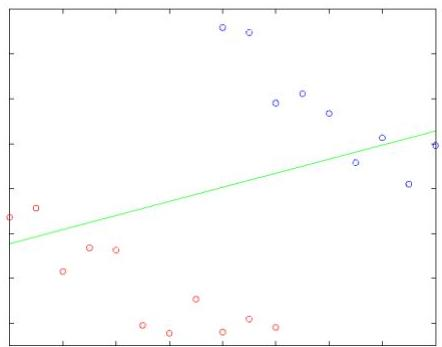
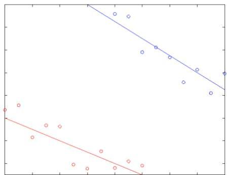

# Learning: spatial splicing

- Spatial heterogeneity: global model might be inconsistent with regional models

global model

regional models

- Learning different models for different spatial regions (and time periods)
- slicing input data can improve the effectiveness of SDM
- slicing output models: e.g. association rule with support map

TÉCNICO+
FORMAÇÃO AVANÇADA