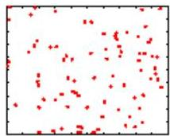
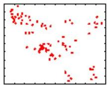
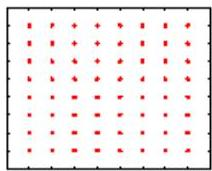
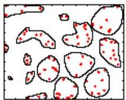
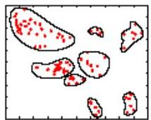
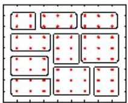
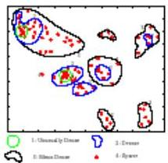
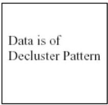

# Spatial clustering

## Variants:
- clustering geographies (maps) ensuring spatial contiguity
- weighted clustering on space and feature-space

Inputs:
Complete Spatial Random (CSR),
Cluster, Decluster

Classical spatial clustering

Data is of Complete Spatial Randomness

Effective spatial clustering

TÉCNICO+
FORMAÇÃO AVANÇADA