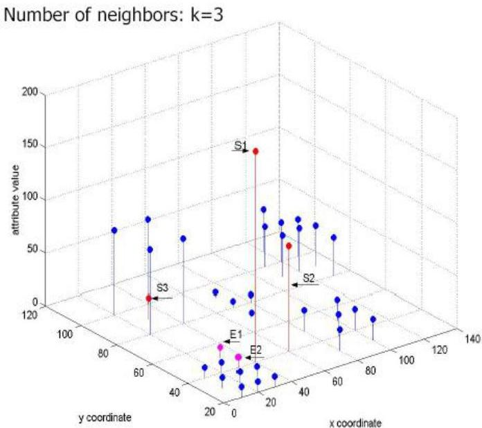

# Spatial outlier analysis

- Traditional
- quantitative tests (scatter spatial plots)
- graphical tests (e.g. variogram)
- Deficiency of traditional tests
- outliers can negatively impact nearby points
- outliers may be ignored
- Solution
- replace the features of the detected outlier with the median of its neighbors' values

Expected Outliers: S1, S2, S3
Outliers by traditional approaches: E1, E2, S1

TÉCNICO+
FORMAÇÃO AVANÇADA