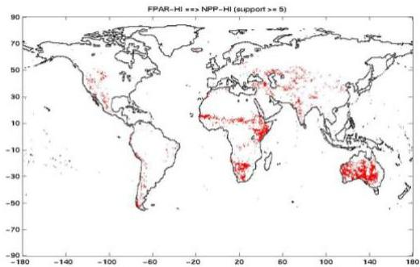
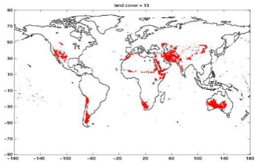
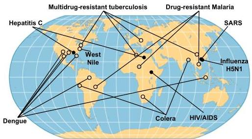
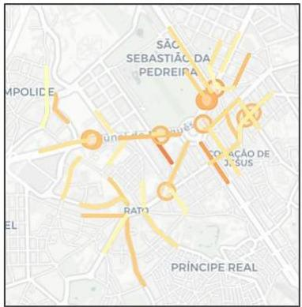

# Spatiotemporal patterns

FPAR-Hi ⇒ NPP-Hi

(sup=5.9%, conf=55.7%)
grassland/shrubland areas

- Newly emerging diseases o Re-emerging diseases

Emerging patterns and spatiotemporal associations
- urban dynamics
- consumer/user habits
- public health (e.g. infectious diseases)
- homeland defense

emerging road traffic
congestions in the city

TÉCNICO+
FORMAÇÃO AVANÇADA