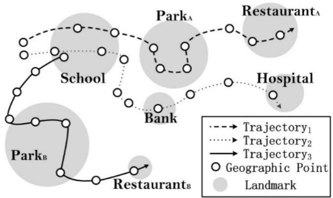
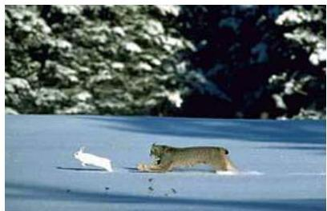

# Spatiotemporal patterns

Open field with thousands of possibilities
- flock patterns on trajectory data
- moving patterns from evolving spatial clusters
- colocation patterns from event data
- patterns whose cause and consequence do not happen colocated or at the same time
- spatial distance or temporal delay for the consequence to show up

... less-trivial (yet relevant) applications
- ecology (e.g. migration, relocation patterns)
- games (e.g. game tactics)

TÉCNICO+
FORMAÇÃO AVANÇADA