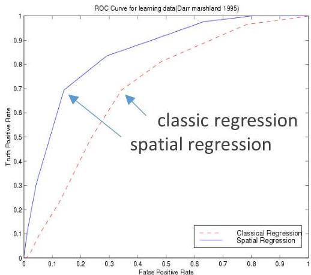

# Location-aware prediction

## Location-aware regression

- spatial autoregressive model (SAR)
- linear Regression  $z = A\beta + \varepsilon$
- spatial Regression  $z = \rho Wy + A\beta + \varepsilon$
- models spatial autocorrelation using  $W$  (continuity matrix)
- geographically weighted regression (GWR)

## Location-aware classification

- logistic SAR and GWR (similarly as classic logistic regression)
- Markov random fields (Bayesian view of the neighborhood region)

ROC Curve for testing data comparing linear and spatial regression (spatial is better)

TÉCNICO+
FORMAÇÃO AVANÇADA