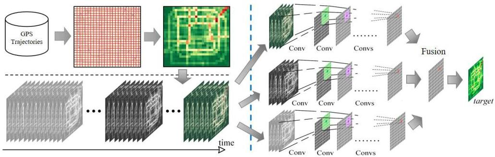

# Spatiotemporal data mining: approaches

## Option 5: deep learning

- spatial locality via convolutional layers
- time dependency (short/long-range) using recurrence, convolutions or attention
- hierarchical layering for multi-scale spatial and temporal representations
- graph neural networks to represent non-Euclidean spatial structures
- modular combination of spatial and temporal neural components into a unified architecture
- parameter sharing in space and time to improve generalization
- spatiotemporal factorization to reduce complexity

## Option 6: LLM prompting

TÉCNICO+
FORMAÇÃO AVANÇADA