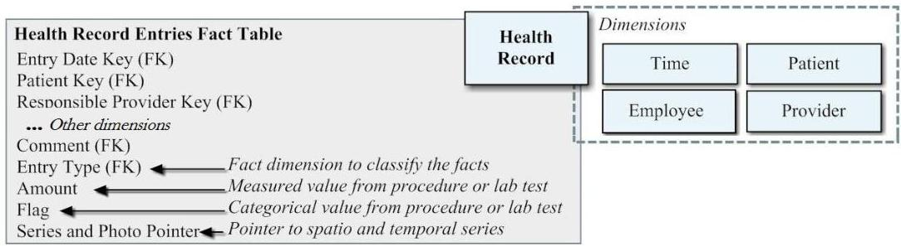

# Mining multi-dimensional data

Example: electronic health records

- Health-record as a central fact table (high multiplicity of measures) linked to multiple dimensions (date, patient, payer, provider, prescription, location)

- Mapping multi-dimensional data ⇒ event sequences
- aggregation dimension (patient) and date dimension to compose repository of events (patient, fact-measure, value, timestamp)

- Learning from event sequences: recall the multiple options! For instance:
1. Discover event patterns (e.g. frequent arrangements)
2. Learn predictive models (e.g. associative classification)