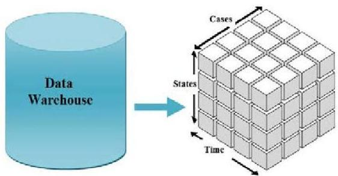

# Learning from multi-dimensional data

- Equals learning from tensors extracted from a fact table
- If the tensor is three-dimensional (cube)
- triclustering
- generative modeling (HMMs, DBNs)
- multivariate time series data analysis
- pattern and motif discovery
- classification and regression
- temporal network data analysis
- If the tensor has $k &gt; 3$ dimensions (hypercube)
- $k$-way subspace clustering
- tensor decomposition
- mapping to more adequate (temporal) data structures
- multi-dimensional space transformations
- denormalization + dimensionality reduction

TÉCNICO+
FORMAÇÃO AVANÇADA