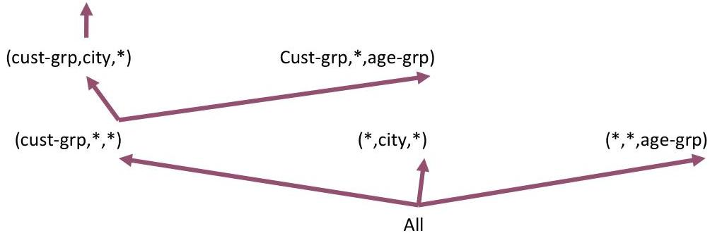

# Example: MD sequential patterns

Mining MD-patterns – e.g. (*,Chicago,*)
- first project seq. databases – e.g. &lt;(bf)(ce)(fg)&gt; and &lt;(ah)abf&gt; for (*,Chicago,*)
- find seq. patterns in projected database – e.g. P=(*,Chicago,*,<bf>)

|  cid | Cust_grp | City | Age_grp | sequence  |
| --- | --- | --- | --- | --- |
|  10 | Business | Boston | Middle | <(bd)cba>  |
|  20 | Professional | Chicago | Young | <(bf)(ce)(fg)>  |
|  30 | Business | Chicago | Middle | <(ah)abf>  |
|  40 | Education | New York | Retired | <(be)(ce)>  |

(cust-grp,city,age-grp)

|  cid | MD-extension of sequences  |
| --- | --- |
|  10 | <(Business,Boston,Middle)(bd)cba>  |
|  20 | <(Professional,Chicago,Young)(bf)(ce)(fg)>  |
|  30 | <(Business,Chicago,Middle)(ah)abf>  |
|  40 | <(Education,New York,Retired)(be)(ce)>  |

TÉCNICO+

FORMAÇÃO AVANÇADA</bf>