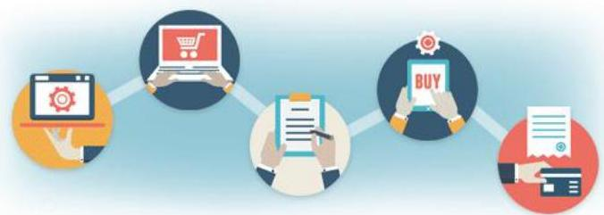

# Sequence data

Examples:
- website navigation
- shopping behaviour
- DNA (univariate symbolic sequence)

Focused on **orders** instead of **time points**

Recall: transactional data structures
- market basket analysis at the level of the basket
- What if I want to mine sequences of baskets per user?
- Answer: **itemset sequence** data, a type of sequence data

TÉCNICO+
FORMAÇÃO AVANÇADA