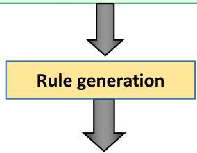
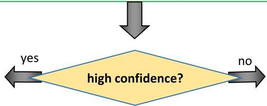

# Example: relational association rules (ILP)

is_a(X, large_town), intersects(X,R), is_a(R, road), adjacent_to(X,W), is_a(W, water)

is_a(X, large_town), intersects(X,R), is_a(R, road), is_a(W, water) → adjacent_to(X,W) [62%, 86%]

TÉCNICO+

FORMAÇÃO AVANÇADA

94