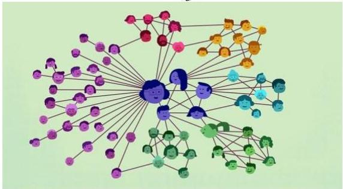

# Many other data structures…

- image, text, multimodal... to be explored in DL and LLM DASH modules
- yet we overlook a pervasive one... network data (graphs)
- most real-world systems can be represented as static or dynamic graphs
- chemical compound structures
- biological networks
- cities (multimodal transportation networks)
- social networks (messaging, content interaction)
- ecosystems
- ...
- the large network science community is dedicated to study systems as graphs
- and you guessed it right: strong intersection with data science

96