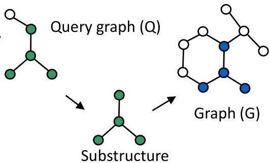
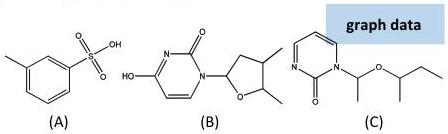
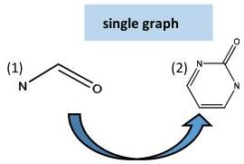

# Example: graph pattern mining

- The five learning approaches can be as well considered when learning from graphs
- Yet for now... a sneak peek to a pattern-centric stance
- Pattern discovery in graphs follows similar principles as we saw for time series
- graph dataset: find frequent subgraphs
- single large graph observation: find frequent components
- We can as well query graphs: find all graphs containing a given query
- All the studied pattern metrics (lift, support, significance) are key here

TÉCNICO+
FORMAÇÃO AVANÇADA