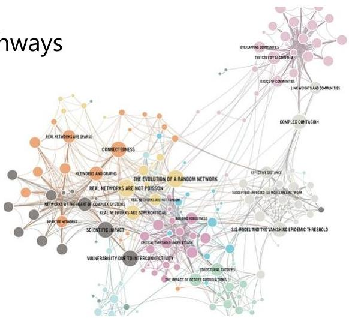

# Example: graph pattern mining

- Bioinformatics: gene networks, protein interactions, metabolic pathways
- Software engineering: program execution flow analysis
- Web graphs, XML structures, semantic web, information networks
- Social networks, web communities, tweets, computer networks
- Chem-informatics: mining chemical compound structures
- Across domains, for different ends:
- knowledge acquisition
- at the core of graph indexing and graph similarity search
- building blocks for graph prediction, clustering, compression, comparison, correlation

TÉCNICO+
FORMAÇÃO AVANÇADA